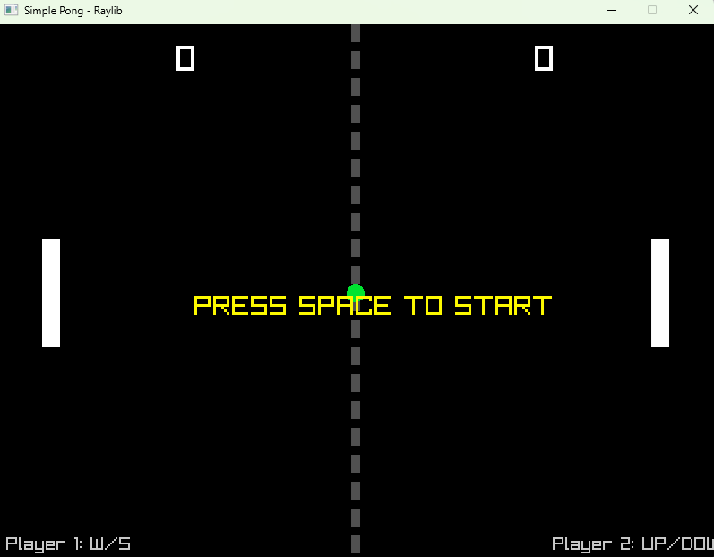

# Pong Game with Raylib



A classic Pong implementation using Raylib-cs for C#. This two-player game features simple controls, realistic ball physics, and score tracking.
Features

    Two-player gameplay (Player 1 vs Player 2)

    Dynamic ball physics with angle-based rebounds

    Score tracking system

    Pause functionality

    Clean visual design with center court line

    On-screen instructions

Requirements

    .NET 6.0 SDK or newer

    Raylib-cs library

Installation

    Clone the repository:

```bash

git clone https://github.com/your-username/pong-raylib.git
```

    Navigate to project directory:

```bash
cd pong-raylib
```

    Install Raylib-cs package:

```bash
dotnet add package raylib-cs
```

How to Play
Controls

    Player 1 (Left paddle): W (up) / S (down)

    Player 2 (Right paddle): Up Arrow (up) / Down Arrow (down)

    Start/Pause: Spacebar

Gameplay

    Press SPACE to start the game

    Score points by getting the ball past your opponent's paddle

    Ball speed increases after each paddle hit

    Ball angle changes based on where it hits the paddle

    First player to score 10 points wins (game continues indefinitely)

Running the Game

```bash
dotnet run
```

Code Structure

The game is contained in a single C# file with the following components:

    Initialization: Sets up window, paddles, and ball

    Input Handling: Processes keyboard input for paddle movement

    Game Logic: Updates ball position, checks collisions, and tracks scores

    Rendering: Draws game elements to the screen

    Reset Function: Resets ball position after each point
